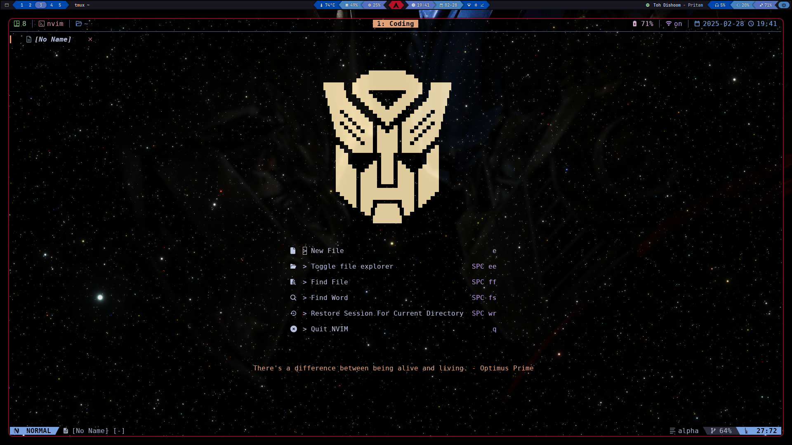
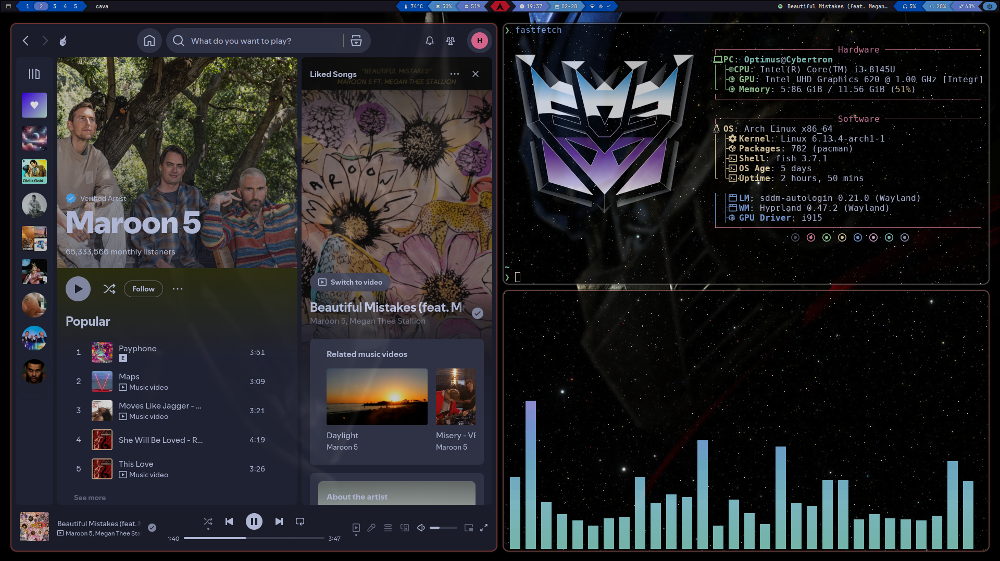

# Arch Hyprland Transformers Setup

A Transformers-themed Arch Linux setup with Hyprland compositor

 <!-- Add your screenshot here -->

## Description

This repository contains my personal dotfiles for a Transformers-themed Arch Linux environment using the Hyprland Wayland compositor. Features custom theming with MechaBar and sleek boot animations.

## Features

- Hyprland window manager
- MechaBar (Custom Waybar implementation)
- adi1090x's Plymouth boot themes
- Rofi application launcher
- Transformers-themed UI elements
- Kitty terminal configuration
- Swaync notification daemon
